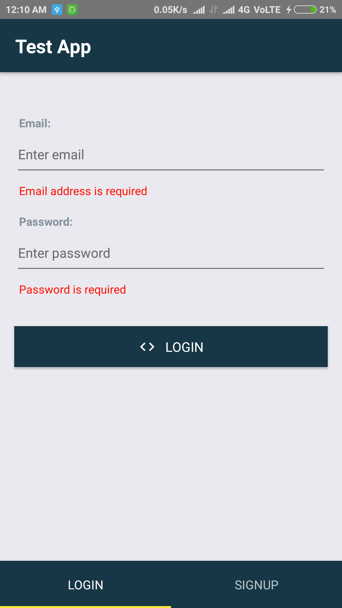
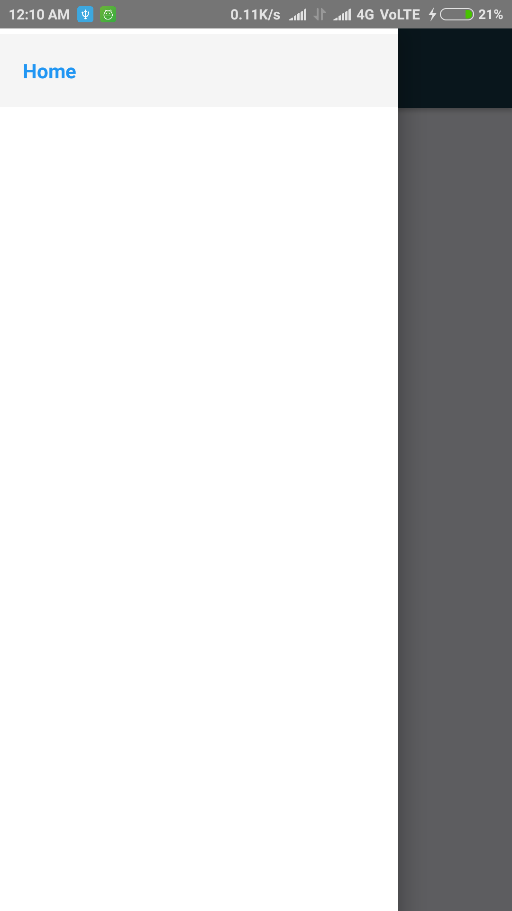

# Using React-Navigation

Implemented all three modes of navigation for react-native.
To know more about this library refer:

https://reactnavigation.org/docs/getting-started.html

https://hackernoon.com/getting-started-with-react-navigation-the-navigation-solution-for-react-native-ea3f4bd786a4

# Screen 1

# Screen 2

# Screen 3

